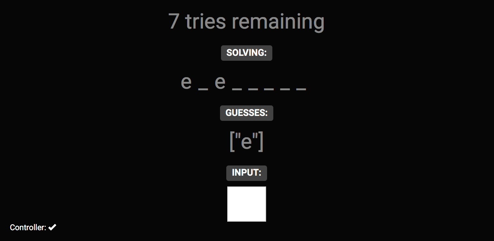
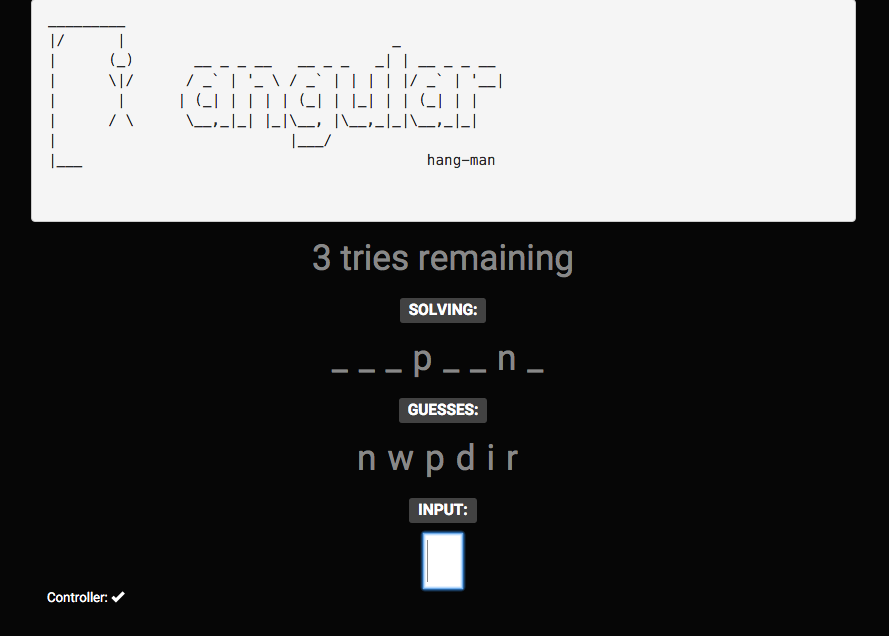

<pre>
_________
|/      |                               _
|      (_)       __ _ _ __   __ _ _   _| | __ _ _ __
|      \|/      / _` | '_ \ / _` | | | | |/ _` | '__|
|       |      | (_| | | | | (_| | |_| | | (_| | |
|      / \      \__,_|_| |_|\__, |\__,_|_|\__,_|_|
|                           |___/
|___                                        hang-man
</pre>

# Purpose

This lab is a chance to use the skills you've developed so far and play with angular.
You'll be making an in-browser [hang-man game](https://en.wikipedia.org/wiki/Hangman_(game)).

Much of the game code is provided for you.  We won't concern ourselves with drawing the
hang-man itself.

## Concepts

* ng-model
* angular controllers
* ng-repeat
* ng-change
* object oriented javascript

# Getting started

1. clone this repo (or fork & clone)
1. open index.html and app.js
1. open hangman.js and read it's contents


### hangman.js

Most of the game code itself has been given to you.  Let's check it out using dev tools.
Open index.html and in the browser console try the following:

```js
hangman = new HangmanGame('test');
```
You should have a new instance of a game. Now try running:

```js
hangman.guess('x');
hangman.guess('t');
hangman.checkGameWinStatus();
```

Note what is returned, and what changes on `hangman`.  You'll use this inside your angular controller.


### Step 1: angular
Let's get angular setup in our app.  

* add `data-ng-app` in the appropriate location
* add your controller using `data-ng-controller=hangmanController as hangman`
* in `app.js` add your controller to the angular module at the top
  * note that an initial function for the controller is provided for you

If this went OK, then when you refresh you should see the `console.log`
statement from the controller and the `Controller:` status in the lower left should
be a check-mark.  If it's an `X`, things are partially working.  If empty, angular is not setup.

<details><summary>Hint:</summary>
```html
<html data-ng-app='hangmanApp'>
....
<div class='container' id="container" data-ng-controller='hangmanController as hangman'>
```
```js
angular.module("hangmanApp", [])
  .controller('hangmanController', hangmanController);
```
</details>

### Step 2: display game properties

* in the controller instantiate a new game instance and store it: `new HangmanGame('elephant')`
* `HangmanGame` provides `guesses`, `completedWord` and `triesRemaining` properties.
Add these in the appropriate parts of the html using `{{ }}` syntax.
  * You might not be able to see the guesses until you make some.  We don't have
  an interface for that yet, but we can add a couple of guesses right in the controller
  Try calling `SOMETHING.guess('f')` inside the controller.  `console.log as needed`
  * Note: `completedWord` is a string containing guessed characters that match, in their
    correct positions.  E.g. if you guessed 'b' and 'r' for 'rabbit', it shows: 'r_bb__'


It should look something like this once you've got it:


### Step 3: user input

* use `ng-model` to track the input field's value
 * you can display it on the page somewhere if you want to verify
* use `ng-change` to call a function when the input changes
  * write a function in your controller for this
  * for now you can just console.log the value of the input
    * make sure to make the function publicly available on a controller instance
      * e.g. `this.checkGuess = yourFunctionName`
  * the input should be cleared after each character is typed

### Step 4: winning

* check guesses using `HangmanGame#guess`
* add some logic in your controller to check if the player has won or lost
* alert them or find another way to let them know

### Step 5: looking better

That array on the page is kinda ugly.  Let's fix it.

* change the array to display using `ng-repeat`
* improve the looks of anything else as desired

### Challenges

* find a way to restart the game after win/lose
* when starting the game use a random word from a list of words
* should it be case insensitive?
* keep score.
* TOUGH: listing "X tries remaining" is boring: develop a way to visualize the drawing of the hangman as the game progresses


# Sample


